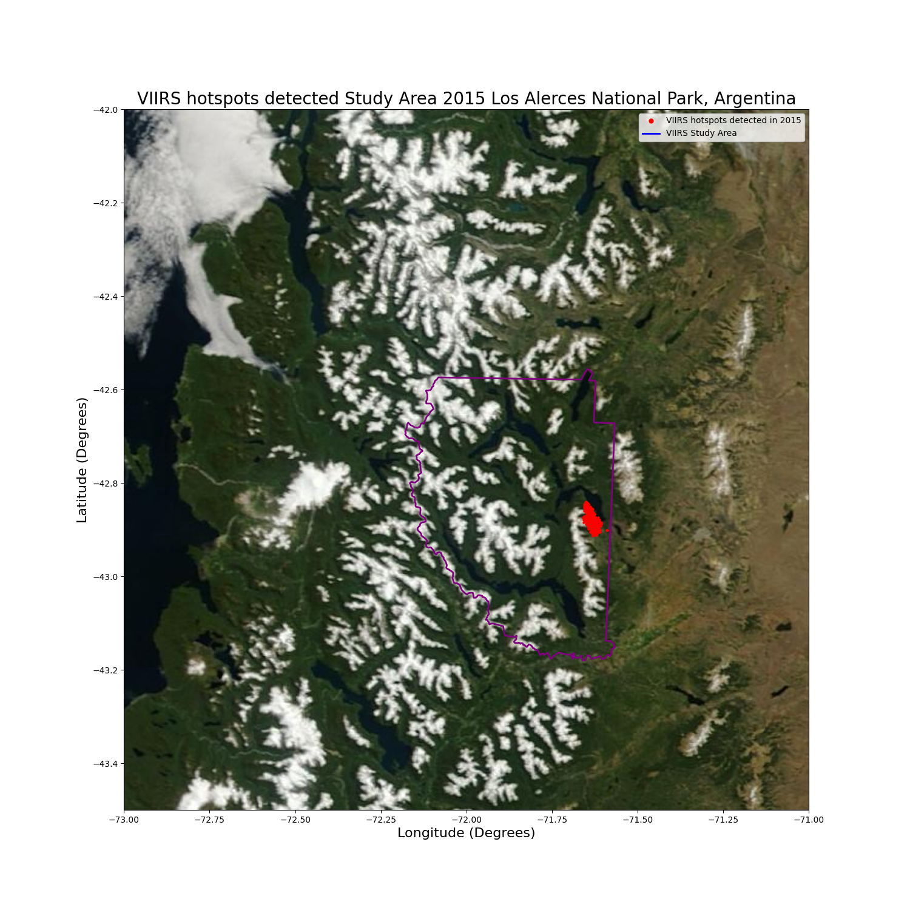
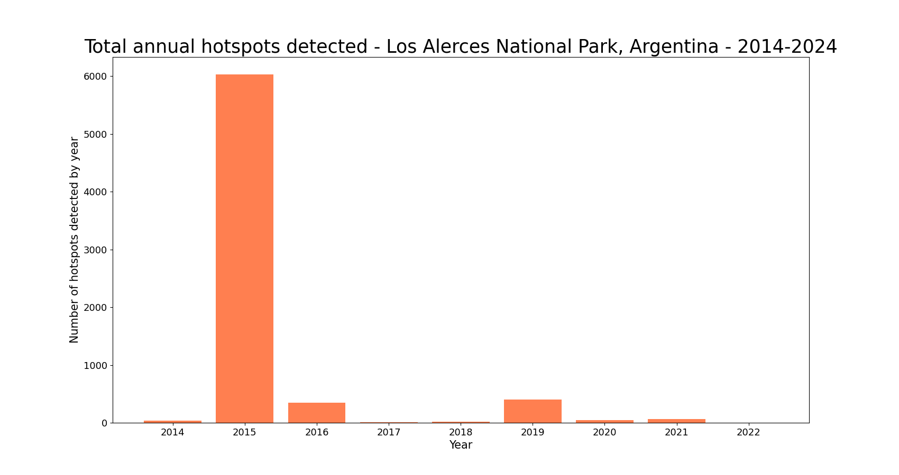
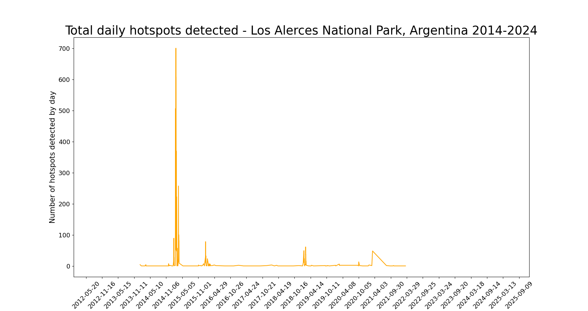
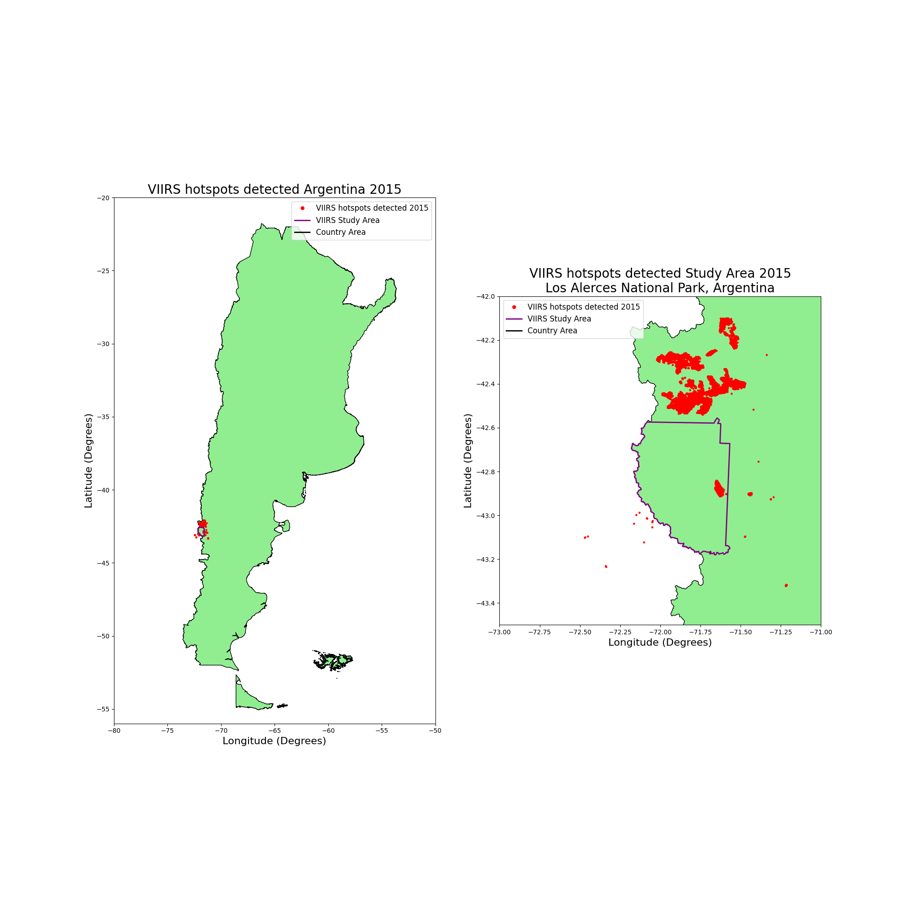

# DRIVENData
# Pale Blue Dot: Visualization Challenge
# Team: Space Discovery 2024

#### **Dataset obtained from FIRMS Fire Map Los Alerces National Park, Argentina**

#### **Fire Source: 375m data**
  * MODIS
  * VIIRS S-NPP
  * VIIRS NOAA-20

View the Jupyter Notebook by clicking on this: [Link](https://github.com/walterm128/drivendata2024visual/blob/main/VIIRSChallengeFinal.ipynb)

Study Area

