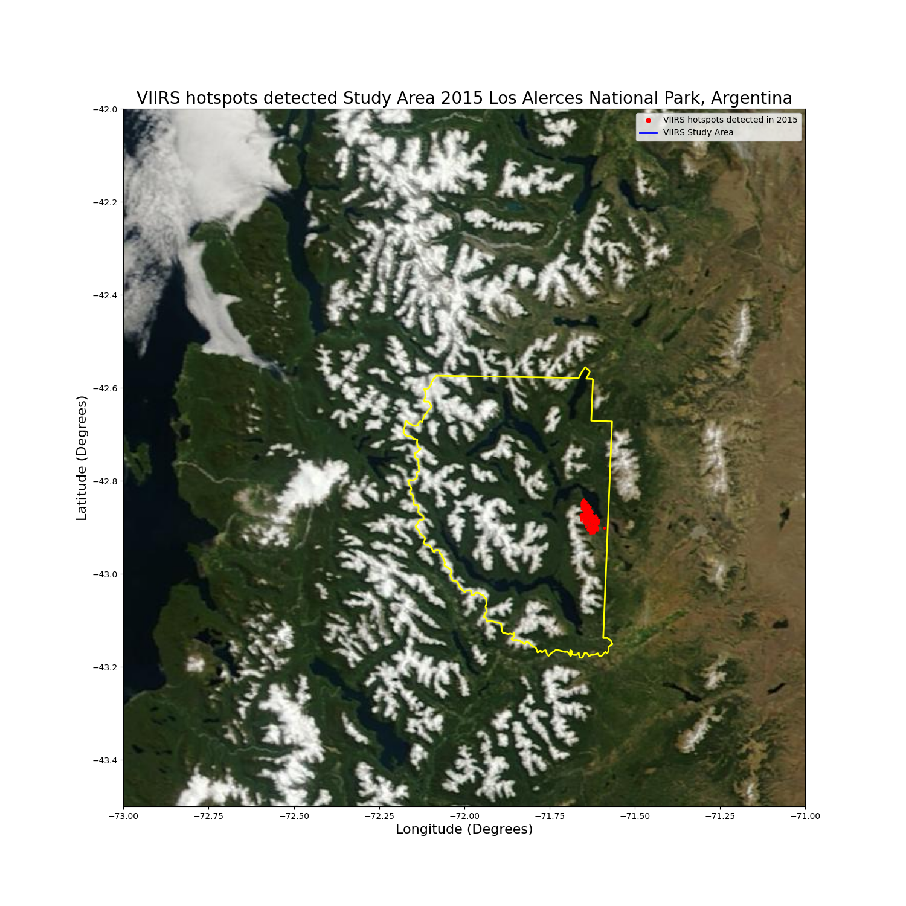

# DRIVENData
# Pale Blue Dot: Visualization Challenge
# Team: Space Discovery 2024
# Alphabetically: Matias E. Klug - Walter M. Wagner

#### **Dataset obtained from FIRMS Fire Map Los Alerces National Park, Argentina**

#### **Fire Source: 375m data**
  * VIIRS S-NPP
  * VIIRS NOAA-20

# **View the Jupyter Notebook by clicking on this: [Link](https://github.com/walterm128/drivendata2024visual/blob/main/VIIRSChallengeFinal.ipynb)**

# **Video of work in progress: [Link](https://youtu.be/rdi4twwtL0k)**

Study Area

#### Logo Team

